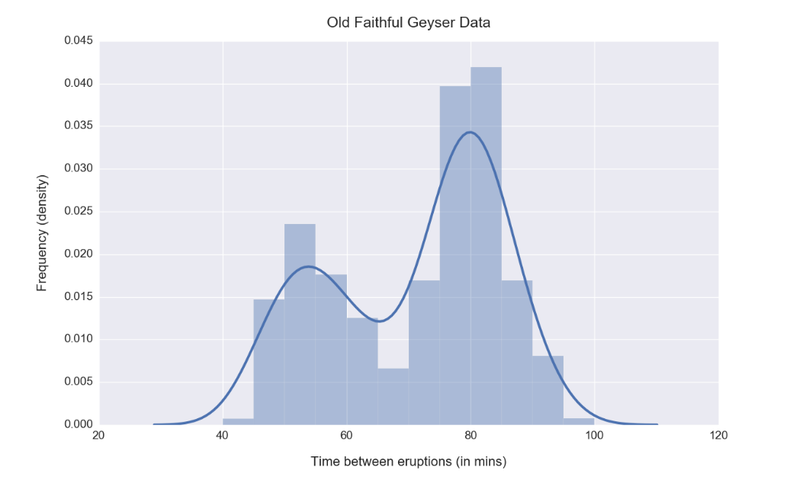
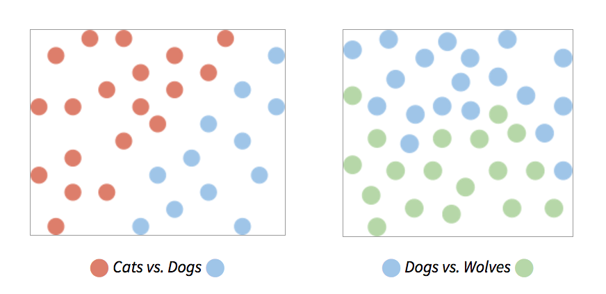

# Machine Learning Interview Preparation

## Interview Guide

- [reference](https://career-resource-center.udacity.com/interview-courses-and-guides/machine-learning)

### Skills and Sample Questions

#### Computer Science Fundamentals and Programming

- Topics
  - Data structures
    - lists, stacks, queues, strings, hash maps, vectors, matrices, classes & objects, trees, graphs, etc.
  - Algorithms
    - recursion, searching, sorting, optimization, dynamic programming, etc.
  - Computability and complexity
    - P vs. NP, NP-complete problems, big-O notation, approximate algorithms, etc.
  - Computer architecture
    - memory, cache, bandwidth, threads & processes, deadlocks, etc.
- Questions
  - How would you check if a linked list has cycles?
  - Given two elements in a binary search tree, find their lowest common ancestor.
  - Write a function to sort a given stack.
  - What is the time complexity of any comparison-based sorting algorithm? Can you prove it?
  - How will you find the shortest path from one node to another in a weighted graph? What if some weights are negative?
  - Find all palindromic substrings in a given string.

#### Probability and Statistics

- Topics
  - Basic probability
    - Conditional probability, Bayes rule, likelihood, independence, etc.
  - Probabilistic models
    - Bayes Nets, Markov Decision Processes, Hidden Markov Models, etc.
  - Statistical measures
    - Mean, median, mode, variance, population parameters vs. sample statistics etc.
  - Proximity and error metrics
    - Cosine similarity, mean-squared error, Manhattan and Euclidean distance, log-loss, etc.
  - Distributions and random sampling
    - Uniform, normal, binomial, Poisson, etc.
  - Analysis methods
    - ANOVA, hypothesis testing, factor analysis, etc.
- Questions
  - The mean heights of men and women in a population were calculated to be Mand W. What is the mean height of the total population?
  - A recent poll revealed that a third of the cars in Italy are Ferraris, and that half of those are red. If you spot a red car approaching from a distance, what is the likelihood that it is a Ferrari?
  - You’re trying to find the best place to put in an advertisement banner on your website. You can make the size (thickness) small, medium or large, and choose vertical position top, middle or bottom. At least how many total page visits (n) and ad clicks (m) do you need to say with 95% confidence that one of the designs performs better than all the other possibilities?
  - The time period between consecutive eruptions of the Old Faithful geyser in Yellowstone National Park is found to have the following distribution. How would you describe/characterize it? What can you infer from it?
    

#### Data Modeling and Evaluation

- Topics
  - Data preprocessing
    - Munging/wrangling, transforming, aggregating, etc.
  - Pattern recognition
    - Correlations, clusters, trends, outliers & anomalies, etc.
  - Dimensionality reduction
    - Eigenvectors, Principal Component Analysis, etc.
  - Prediction
    - Classification, regression, sequence prediction, etc.; suitable error/accuracy metrics.
  - Evaluation
    - Training-testing split, sequential vs. randomized cross-validation, etc.
- Questions
  - A dairy farmer is trying to understand the factors that affect milk production of her cattle. She has been keeping logs of the daily temperature (usually 30-40°C), humidity (60-90%), feed consumption (2000-2500 kgs), and milk produced (500-1000 liters).
    - How would you begin processing the data in order to model it, with the goal of predicting liters of milk produced in a day?
    - What kind of machine learning problem is this?
  - Your company is building a facial expression coding system, which needs to take input images from a standard HD 1920x1080 pixel webcam, and continuously tell whether the user is in one of the following states: neutral, happy, sad, angry or afraid. When the user’s face is not visible in the camera frame, it should indicate a special state: none.
    - What class of machine learning problems does this belong to?
    - If each pixel is made up of 3 values (for red, green, blue channels), what is the raw input data complexity (no. of dimensions) for processing each image? Is there a way to reduce the no. of dimensions?
    - How would you encode the output of the system? Explain why.
  - Climate data collected over the past century reveals a cyclic pattern of rising and falling temperatures. How would you model this data (a sequence of average annual temperature values) to predict the average temperature over the next 5 years?
  - Your job at an online news service is to collect text reports from around the world, and present each story as a single article with content aggregated from different sources. How would you go about designing such a system? What ML techniques would you apply?

#### Applying Machine Learning Algorithms and Libraries

- Topics
  - Models
    - Parametric vs. nonparametric, decision tree, nearest neighbor, neural net, support vector machine, ensemble of multiple models, etc.
  - Learning procedure
    - Linear regression, gradient descent, genetic algorithms, bagging, boosting, and other model-specific methods; regularization, hyperparameter tuning, etc.
  - Tradeoffs and gotchas
    - Relative advantages and disadvantages, bias and variance, overfitting and underfitting, vanishing/exploding gradients, missing data, data leakage, etc.
- Questions
  - You’re trying to classify images of cats and dogs. Plotting the images in some transformed 2-dimensional feature space reveals the following pattern (on the left). In some other space, images of dogs and wolves show a different pattern (on the right).
  
  - What model would you use to classify cats vs. dogs, and what would you use for dogs vs. wolves? Why?
  - I’m trying to fit a single hidden layer neural network to a given dataset, and I find that the weights are oscillating a lot over training iterations (varying wildly, often swinging between positive and negative values). What parameter do I need to tune to address this issue?
  - When training a support vector machine, what value are you optimizing for?
  - Lasso regression uses the L1-norm of coefficients as a penalty term, while ridge regression uses the L2-norm. Which of these regularization methods is more likely to result in sparse solutions, where one or more coefficients are exactly zero?
  - When training a 10-layer neural net using backpropagation, I find that the weights for the top 3 layers are not changing at all! The next few layers (4-6) are changing, but very slowly. What’s going on and how do I fix this?
  - I’ve found some data about wheat-growing regions in Europe that includes annual rainfall (R, in inches), mean altitude (A, in meters) and wheat output (O, in kgs/km2). A rough analysis and some plots make me believe that output is related to the square of rainfall, and log of altitude: O = β0 + β1 × R2 + β2 × loge(A) Can I fit the coefficients (β) in my model to the data using linear regression?

#### Software Engineering and System Design

- Topics
  - Software interface
    - Library calls, REST APIs, data collection endpoints, database queries, etc.
  - User interface
    - Capturing user inputs & application events, displaying results & visualization, etc.
  - Scalability
    - Map-reduce, distributed processing, etc.
  - Deployment
    - Cloud hosting, containers & instances, microservices, etc.
- Questions
  - You run an ecommerce website. When a user clicks on an item to open its details page, you would like to suggest 5 more items that the user may be interested in, based on item features as well as the user’s purchase history, and display them at the bottom of the page. What services and database tables would you need to support this behavior? Assuming they’re available, write a query or procedure to fetch the 5 items to suggest.
  - What data would you like to collect from an online video player (like YouTube) to measure user engagement and video popularity?
  - A very simple spam detection system works as follows: It processes one email at a time and counts the number of occurrences of each unique word in it (term frequency), and then it compares those counts with those of previously seen emails which have been marked as spam or not. In order to scale up this system to handle a large volume of email traffic, can you design a map-reduce scheme that can run on a cluster of computers?
  - You want to generate a live visualization of what portion of a webpage users are currently viewing and clicking, sort of like a heat map. What components/services/APIs do you need in place, on the client and server end, to enable this?

## References

- [Udacity: Career Resource Center](https://career-resource-center.udacity.com/)